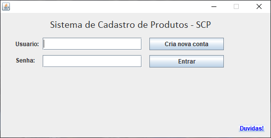
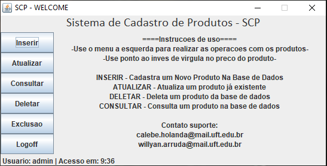

# Banco de dados em Java

Trabalho desenvolvido em dupla para disciplina de Banco de Dados.
 

Aplicação em java que salva, lê e deleta os registros em um arquivo de texto simulando um banco de dados.

<h3>Tela de LogIn</h3>

<h3>Menu principal da aplicação</h3>

